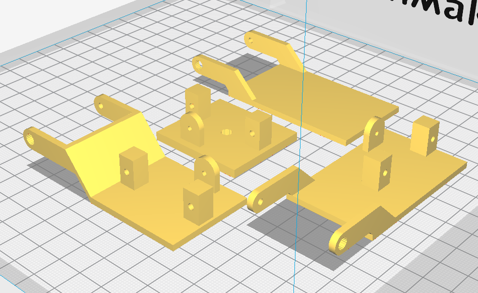
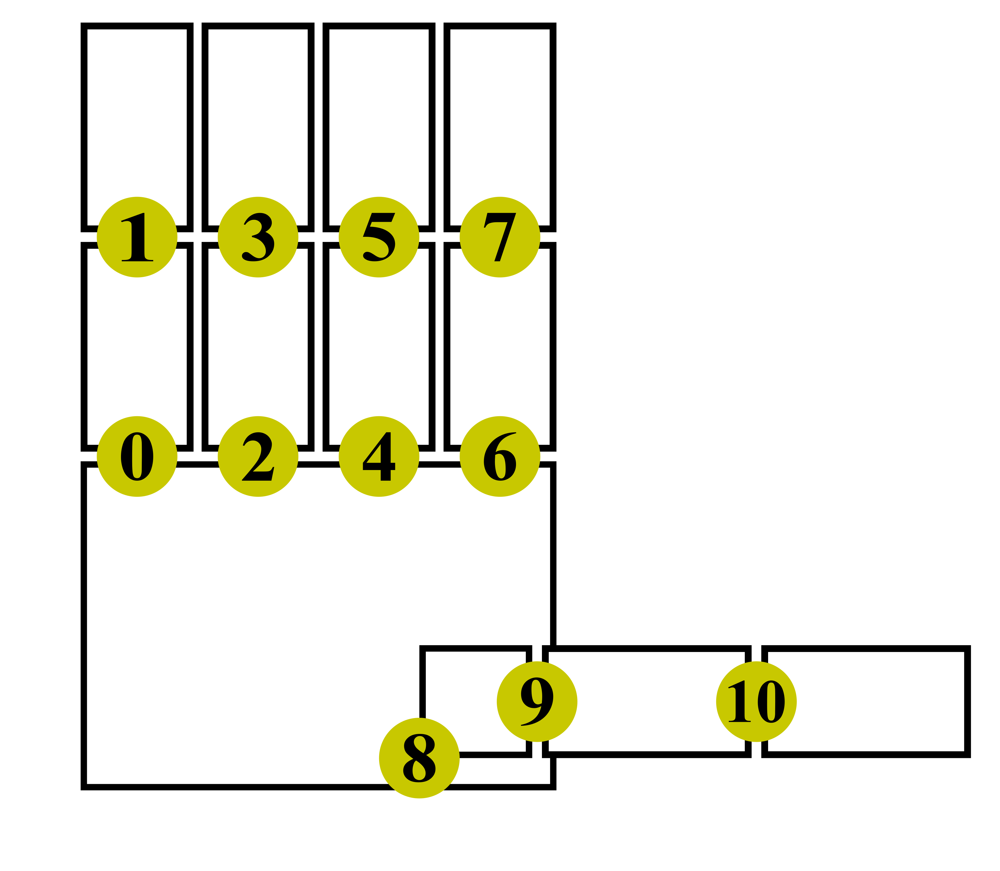

# articulating-hand

### Table of Contents

1. Package Contents
2. Necessary Components
3. Assembly
4. ROS Structure
5. Operation
6. Troubleshooting

### Package Contents

- Bill of materials
- CAD files
- Laser cutter profiles
- Arduino sketches
- ROS directories and files
    - /config
        - RViz configuration file
    - /launch
        - Program launch file
    - /model
        - **.yaml** files holding geometric parameters
        - **.xacro** files to build robot model
    - /msg
        - Custom message files for servo-driving communication
    - /nodes
        - **slider_gui**: GUI initialization script
        - **update_joints**: servo position -> joint angle conversion algorithm
    - CMakeLists.txt
    - package.xml

### Necessary Components

See Bill of Materials for specific part designations.

- Arduino Uno (1)
- USB cable Type A/B (1)
- Servo driver board (1)
- 3/32" acrylic sheet (1)
- Servo motors (11)
- Screws (don't know exact sizes/numbers right now [3/20/20] because I can't go into the lab to count due to COVID-19 but will update)

### Assembly
#### Printed Parts

Component files provided in .stl form for easy 3D printing. If multiple files exist for the same part, use the file with the highest version number.

Print parts with 0.1mm layer height for best results. Print all pieces with largest flat side touching print bed (see below). Use 25% infill with an appropriate pattern to prevent flat surfaces from sagging. Use supports.

**Number of Pieces to Print:**
- Distal finger: 5
- Proximal finger: 4
- CMC joint small: 1
- CMC joint big: 1

#### Laser-Cut Parts

Cut both profiles in /Laser_Cut out of 3/32" acrylic.

**Number of Pieces Produced:**
- Angled mounting tab: 8
- Square stabilizing tab: 4
- Palm: 1

#### Construction

Note: tap all holes before inserting screws!

Assemble fingers left to right (pinky finger -> index finger direction) for ease of assembly.

Mount servo motors to proximal finger pieces using screws. Attach distal finger pieces to servo knobs via press-fit. Connect distal finger piece to proximal finger piece using screw through stabilizing tab.

Insert two angled mounting tabs through paired slots in palm. Attach servo to tabs using screws. Servo will have some up-and-down "wiggle room" but should not pull away from palm. Attach square stabilizing tab to proximal finger tab using screw. Insert stabilizing tab into single slot in palm and slide forward so slot engages with palm. Attach proximal finger piece to servo by press-fitting tab onto servo knob. Repeat process for all four fingers.

Insert servo into thumb slot and drill mounting holes. Attach to palm using screws. Mount servo to small CMC joint piece using screws. Mount servo to big CMC joint piece using screws. Attach distal finger piece to big CMC joint piece via press-fit and screw in stabilizing tab. Attach big CMC joint piece to small CMC joint piece via press-fit and screw in stabilizing tab.Connect small CMC joint piece to palm by press-fitting onto mounted servo knob.

#### Electrical Connections

Connect Arduino to your computer using USB cable.

Connect servo plugs to driver board per joint numbering convention shown below.

Connect servo driver board to Arduino:

| Arduino pin | Driver board pin |
|:-----------:|:----------------:|
| 5V          | VCC              |
| GND         | GND              |
| A4 (SDA)    | SCL              |
| A5 (SCL)    | SDA              |

Connect driver board to wall power using the plug.

### ROS Structure
#### Nodes
- /converter
    - Creates ROS JointState messages from servo position commands
    - Publishers: `joint_states`
    - Subscribers: `servo_cmd`
- /slider_bar_gui
    - Creates and updates the control GUI window
    - Generates commands to drive servos
    - Publishers: `servo_cmd`
    - Subscribers: None
- /arduino
    - Creates joint motion via PWM signals in response to command
    - Publishers: None
    - Subscribers: `servo_cmd`
- /robot_state_publisher
    - Makes the robot state (ex: position and velocity) available for motion planning, visualization, and simulation
- /rviz
    - Provides visualization for robot positioning

#### Topics/Types
Note: only custom types written for this package are included here.

- `servo_cmd`: custom message type `ServoArray`, array of 2-vectors each holding a servo number and position; allows for compact communication by holding all servo position commands in one message

### Operation
#### Launching/Exiting Program:
1. Navigate to workspace root directory
2. `catkin_make`
3. `source devel/setup.bash`
4. `roslaunch articulating_hand hand_bot.launch` (can be done from any directory location in same terminal window)
5. `Ctrl+C` in same terminal window to exit

#### Joint Control
*Using GUI (recommended):*  
&nbsp;&nbsp;&nbsp;&nbsp;Click and drag slider bars in GUI window to move joints.

*Publishing message from command line:*  
&nbsp;&nbsp;&nbsp;&nbsp;In a new terminal window, `rostopic pub /servo_cmd articulating_hand/ServoDrive <servo_number> <servo_position> --once`.  
&nbsp;&nbsp;&nbsp;&nbsp;This method is not recommended, as it cannot detect whether you are attempting to (a) drive a servo that does not exist, or (b) drive a servo beyond its physical operating limits.

### Troubleshooting

When uploading sketch to Arduino:
- *ioctl("TIOCMSET"): Protocol error* 
    &nbsp;&nbsp;&nbsp;&nbsp;Unplug USB cable and plug back in

Common ROS Error:
- *Unable to sync with device; possible link problem...* 
    &nbsp;&nbsp;&nbsp;&nbsp;Usually caused by baud rate mismatch between Arduino and ROS. Outbound baud rate is set in **hand_bot.launch** under <node name="arduino"...>; inbound baud rate is set in **servo_controller.ino** by command `nh.getHardware()->setBaud(BAUD)`. Make sure these match.
